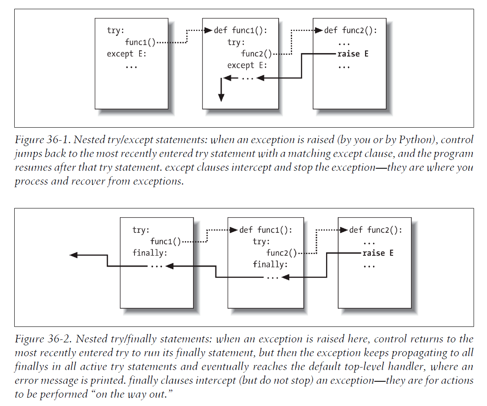

# Nesting Exception Handlers
Most of our examples so far have used only a single try to catch exceptions, but what happens if one try is physically nested inside another? For that matter, what does it mean if a try calls a function that runs another try? Technically, try statements can nest, in terms of both syntax and the runtime control flow through your code. I've mentioned this briefly, but let's clarify the idea here. 

Both of these cases can be understood if you realize that Python stacks try statements at runtime. When an exception is raised, Python returns to the most recently entered try statement with a matching except clause. Because each try statement leaves a marker, Python can jump back to earlier trys by inspecting the stacked markers. This nesting of active handlers is what we mean when we talk about propagating exceptions up to "higher" handlers -- such handlers are simply try statements entered earlier in the program's execution flow.

Figure 36-1 illustrates what occurs when try statements with except clauses nest at runtime. The amount of code that goes into a try block can be substantial, and it may contain function calls that invoke other code watching for the same exceptions. When an exception is eventually raised, Python jumps back to the most recently entered try statement that names that exception, runs that statement's except clause, and then resumes execution after that try.

Once the exception is caught, its life is over-control does not jump back to all matching trys that name the exception; only the first (i.e., most recent) one is given the opportunity to handle it. In Figure 36-1, for instance, the raise statement in the function func2 sends control back to the handler in func1, and then the program continues within func1.



By contrast, when try statements that contain only finally clauses are nested, each finally block is run in turn when an exception occurs -- Python continues propagating the exception up to other trys, and eventually perhaps to the top-level default handler (the standard error message printer). As Figure 36-2 illustrates, the finally clauses do not kill the exception -- they just specify code to be run on the way out of each try during the exception propagation process. If there are many try/finally clauses active when an exception occurs, they will all be run, unless a try/except catches the exception somewhere along the way.

In other words, where the program goes when an exception is raised depends entirely upon where it has been -- it's a function of the runtime flow of control through the script, not just its syntax. The propagation of an exception essentially proceeds backward through time to try statements that have been entered but not yet exited. This propagation stops as soon as control is unwound to a matching except clause, but not as it passes through finally clauses on the way.

## Example: Control-Flow Nesting
Let's turn to an example to make this nesting concept more concrete. The following module file, nestexc.py, defines two functions. action2 is coded to trigger an exception (you can't add numbers and sequences), and action1 wraps a call to action2 in a try handler, to catch the exception:
> 
> > ```python
> > def action2():
> >     print(1 + []) 					# Generate TypeError
> > def action1():
> >     try:
> >         action2()
> >     except TypeError: 				# Most recent matching try
> >         print('inner try')
> > 
> > try:
> >     action1()
> > except TypeError: 					# Here, only if action1 re-raises
> >     print('outer try')
> > ```
> 
> > ```powershell
> > % python nestexc.py
> > inner try
> > ```
> 

Notice, though, that the top-level module code at the bottom of the file wraps a call to action1 in a try handler, too. When action2 triggers the TypeError exception, there will be two active try statements -- the one in action1, and the one at the top level of the module file. Python picks and runs just the most recent try with a matching except -- which in this case is the try inside action1.

Again, the place where an exception winds up jumping to depends on the control flow through the program at runtime. Because of this, to know where you will go, you need to know where you've been. In this case, where exceptions are handled is more a function of control flow than of statement syntax. However, we can also nest exception handlers syntactically -- an equivalent case we turn to next.

## Example: Syntactic Nesting
As I mentioned when we looked at the new unified try/except/finally statement in Chapter 34, it is possible to nest try statements syntactically by their position in your source code:
> ```python
> try:
>     try:
>         action2()
>     except TypeError: 				# Most recent matching try
>         print('inner try')
> except TypeError: 					# Here, only if nested handler re-raises
>     print('outer try')
> ```

Really, though, this code just sets up the same handler-nesting structure as (and behaves identically to) the prior example. In fact, syntactic nesting works just like the cases sketched in Figure 36-1 and Figure 36-2. The only difference is that the nested handlers are physically embedded in a try block, not coded elsewhere in functions that are called from the try block. For example, nested finally handlers all fire on an exception, whether they are nested syntactically or by means of the runtime flow through physically separated parts of your code:
> ```python
> >>> try:
> ...     try:
> ...         raise IndexError
> ...     finally:
> ...         print('spam')
> ... finally:
> ...     print('SPAM')
> ...
> spam
> SPAM
> Traceback (most recent call last):
> File "<stdin>", line 3, in <module>
> IndexError
> ```

See Figure 36-2 for a graphic illustration of this code's operation; the effect is the same, but the function logic has been inlined as nested statements here. For a more useful example of syntactic nesting at work, consider the following file, except-finally.py:
> ```python
> def raise1(): raise IndexError
> def noraise(): return
> def raise2(): raise SyntaxError
> 
> for func in (raise1, noraise, raise2):
>     print('<%s>' % func.__name__)
>     try:
>         try:
>             func()
>         except IndexError:
>             print('caught IndexError')
>     finally:
>         print('finally run')
>     print('...')
> ```

This code catches an exception if one is raised and performs a finally termination-time action regardless of whether an exception occurs. This may take a few moments to digest, but the effect is the same as combining an except and a finally clause in a single try statement in Python 2.5 and later:
> ```powershell
> % python except-finally.py
> <raise1>
> caught IndexError
> finally run
> ...
> <noraise>
> finally run
> ...
> <raise2>
> finally run
> Traceback (most recent call last):
> File "except-finally.py", line 9, in <module>
> func()
> File "except-finally.py", line 3, in raise2
> def raise2(): raise SyntaxError
> SyntaxError: None
> ```

As we saw in Chapter 34, as of Python 2.5, except and finally clauses can be mixed in the same try statement. This, along with multiple except clause support, makes some of the syntactic nesting described in this section unnecessary, though the equivalent runtime nesting is common in larger Python programs. Moreover, syntactic nesting still works today, may still appear in code written prior to Python 2.5 that you may encounter, can make the disjoint roles of except and finally more explicit, and can be used as a technique for implementing alternative exception-handling behaviors in general.
