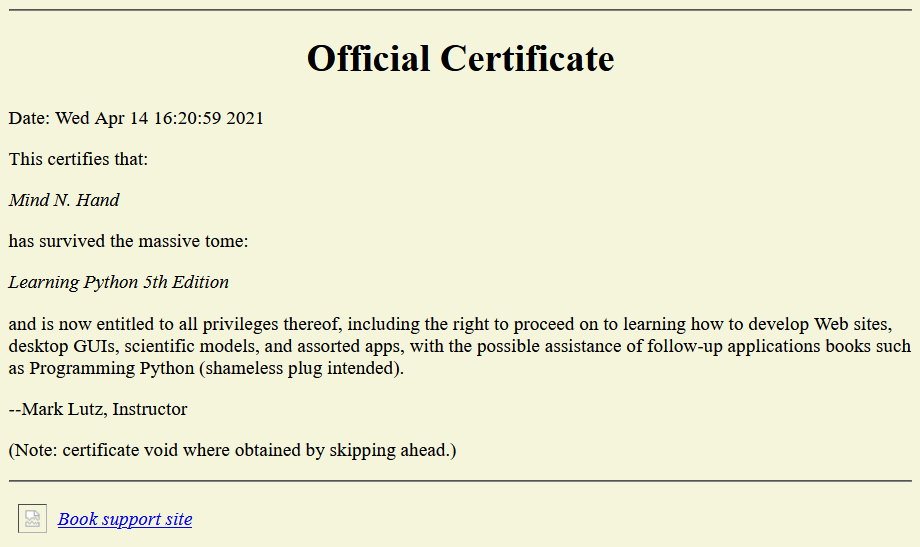

# Encore: Print Your Own Completion Certificate!
And one last thing: in lieu of exercises for this part of the book, I'm going to post a bonus script here for you to study and run on your own. I can't provide completion certificates for readers of this book (and the certificates would be worthless if I could), but I can include an arguably cheesy Python script that does -- the following file, certificate.py, is a Python 2.X and 3.X script that creates a simple book completion certificate in both text and HTML file forms, and pops them up in a web browser on your machine by default.

> ```python
> #!/usr/bin/python
> """
> File certificate.py: a Python 2.X and 3.X script.
> Generate a bare-bones class completion certificate: printed,
> and saved in text and html files displayed in a web browser.
> """
> from __future__ import print_function 				# 2.X compatibility
> import time, sys, webbrowser
> 
> if sys.version_info[0] == 2: 						# 2.X compatibility
>     input = raw_input
>     import cgi
>     htmlescape = cgi.escape
> else:
>     import html
>     htmlescape = html.escape
> 
> maxline = 60 							# For seperator lines
> browser = True 							# Display in a browser
> saveto = 'Certificate.txt' 				# Output filenames
> template = """
> %s
> 
> 
> ===> Official Certificate <===
> 
> Date: %s
> 
> This certifies that:
> 
> \t%s
> 
> has survived the massive tome:
> 
> \t%s
> 
> and is now entitled to all privileges thereof, including
> the right to proceed on to learning how to develop Web
> sites, desktop GUIs, scientific models, and assorted apps,
> with the possible assistance of follow-up applications
> books such as Programming Python (shameless plug intended).
> 
> --Mark Lutz, Instructor
> 
> (Note: certificate void where obtained by skipping ahead.)
> 
> %s
> """
> 
> # Interact, setup
> for c in 'Congratulations!'.upper():
>     print(c, end=' ')
>     sys.stdout.flush() 				# Else some shells wait for \n
>     time.sleep(0.25)
> print()
> 
> date = time.asctime()
> name = input('Enter your name: ').strip() or 'An unknown reader'
> sept = '*' * maxline
> book = 'Learning Python 5th Edition'
> 
> # Make text file version
> file = open(saveto, 'w')
> text = template % (sept, date, name, book, sept)
> print(text, file=file)
> file.close()
> 
> # Make html file version
> htmlto = saveto.replace('.txt', '.html')
> file = open(htmlto, 'w')
> tags = text.replace(sept, '<hr>') 				# Insert a few tags
> tags = tags.replace('===>', '<h1 align=center>')
> tags = tags.replace('<===', '</h1>')
> tags = tags.split('\n') 						# Line-by-line mods
> tags = ['<p>' if line == '' else line for line in tags]
> tags = ['<i>%s</i>' % htmlescape(line) if line[:1] == '\t' else line for line in tags]
> tags = '\n'.join(tags)
> 
> link = '<i><a href="http://www.rmi.net/~lutz">Book support site</a></i>\n'
> foot = '<table>\n<td>\n<td>%s</table>\n' % link
> tags = '<html><body bgcolor=beige>' + tags + foot + '</body></html>'
> 
> print(tags, file=file)
> file.close()
> 
> # Display results
> print('[File: %s]' % saveto, end='')
> print('\n' * 2, open(saveto).read())
> if browser:
>     webbrowser.open(saveto, new=True)
>     webbrowser.open(htmlto, new=False)
> 
> if sys.platform.startswith('win'):
>     input('[Press Enter]') 						# Keep window open if clicked on Windows
> ```

Run this script on your own, and study its code for a summary of some of the ideas we've covered in this book. Fetch it from this book's website described in the preface if you wish. You won't find any descriptors, decorators, metaclasses, or super calls in this code, but it's typical Python nonetheless.

When run, it generates the web page captured in the fully gratuitous Figure 41-1. This could be much more grandiose, of course; see the Web for pointers to Python support for PDFs and other document tools such as Sphinx surveyed in Chapter 15. But hey: if you've made it to the end of this book, you deserve another joke or two...  


